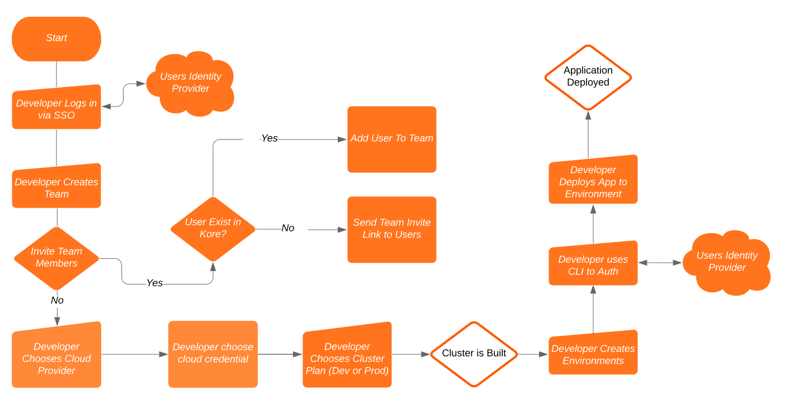

### **[Architecture](#architecture)** •  **[Getting Started](doc/getting-started.md)** • **[Roadmap](#roadmap)**

## Kubernetes for Teams via Appvia Kore (Alpha)
- **Cluster provisioning** provides secure and consistent provisioning of kubernetes environments for teams.
- **Accounts & Account Users** provides a single source for access and control across the estate.
- **Plans and Templates** allows the administrators to define the type and shape of resources for teams to consume.
- **Managed Access Controls** Provides a central means to manage and configure roles, policies and permissions across the estate.

## Contents
- [Local Quick Start](#local-quick-start)
- [Why Appvia Kore?](#why-appvia-kore)
- [The Developer](#the-developer)
- [The DevOps](#the-devops)
- [Architecture](#architecture)

## Local Quick Start

The fastest way to provision teams on Appvia Kore (Alpha) is try it out locally.

See our [Local Quick Start Guide (Alpha)](doc/alpha-local-quick-start.md).

### Appvia Kore / Kubernetes API / GKE

In local mode, Appvia Kore will start the Kubernetes API locally. But, will still need access to a Kubernetes provider to create clusters.

We'll utilise [GKE](https://cloud.google.com/kubernetes-engine) for this. And, we'll help you set it up to work with Appvia Kore. 

**Please Note**: Created GKE clusters are for demo purposes only. They're tied to a local environment and will be orphaned once the local Kore instance is stopped.

### Appvia Kore CLI

The Quick Start guide will walk you through using the CLI to set up a team, provision a sandbox environment and deploy a sample application.

## Why Appvia Kore?

Appvia Kore is designed to make Kubernetes a commodity for your organisation and teams. Allowing any team to be able to get Kubernetes simply and easily, without relying on specialist resources to provision it for you, set it up and give you access credentials.

## The Developer

>-   **Self serve Kubernetes clusters with best practice**
>-   **On board and off board your teammates**
>-   **Manage your Role Based Access Controls**

You know how to work with containers or you’re starting that journey, but learning Kubernetes and Cloud is complicated and not necessarily a good use of your time. You just want to start deploying applications and using in-cluster or cloud services to start showing off your great work!

With Kore an administrator can configure a set of default known cluster best practices so you and your teammates can provision clusters safely and securely. You can on-board and off-board your own users, with them automatically getting access so you can iterate and deploy applications easily.

You can see what versions are deployed where, generate robot tokens for your Continuous Integration system and start iterating quickly and securely! With out-of-the-box developer roles and policies, you know that your applications are meeting the security requirements they need to!

## The DevOps

>-   **Define best practice clusters as plans for developer teams to self-serve**
>-   **Push user and application policies to clusters to enforce organisation wide controls**
>-   **Iterate cluster validation as Code in your CI pipelines**
>-   **Improve Kubernetes cluster security with security policies**

You know what your developers need, they are also not shy of telling you! But you want to make sure that they get reliable, scalable and secure services before they consume them. Configuring all of this takes time and some of the components can be very complicated and time consuming to do correctly.

Not only that, but there is the cloud provisioning and architecture, that adds another hurdle to get over before teams can even consume Kubernetes and other cloud services! With Kore, we decided to enable cloud setup, as cloud accounts or projects are free, you can isolate teams to accounts, making cloud cost management, security and access controls simpler!

You can also setup default Kubernetes cluster plans that developer teams can consume without you needing to run CI, code or scripts. You can validate the plans work as they should once and then make them available. This might be anything from a Developer plan that is a single availability zone with cheap instance types, through to production plans with enhanced security settings across multiple availability zones for resilience and on-demand instances.

You can also define sensible policies globally, enhancing the security footprint once across all of your teams, so you know that everyone is working consistently and safely!

## Architecture

Appvia Kore reuses the Kubernetes framework and enhances it to provide a more enriched set of features as well as an improved and simplified developer and operations experience. These enhancements that we have created are:

> -  **Kubernetes Cluster Plans**
>-   **Team management and creation**
>-   **SSO and authentication with your organisation IDP**
> -  **Auditability on user actions, cluster creation and access management**

Each enhancement works under the operator framework. The operators are domain specific features, such as team management or SSO configuration. To bring each domain specific operator together, we have the Kore API, which bridges each service and manages the coordination of data into each operator on your behalf.

All of the components run as a set of containers, so as long as there is Docker, you can run this either locally or in cloud. As it is using the Kubernetes framework, Kubernetes is a prerequisite to host Appvia Kore.

Note Appvia Kore is deemed an early release, the project is not regarded as production ready and is under rapid development; thus expect new features to rollout.

### Administrator Flow

### Developer Team Flow

## Roadmap

Currently on the roadmap the following is either near completion and merge or currently in the works.

- Cloud account management; provision of account management with the cloud provider.
- Security compliance of cloud account and settings.
- Operational review of deployments, versions, image vulnerabilities.
- Extension of resource plans and allocations for teams.
