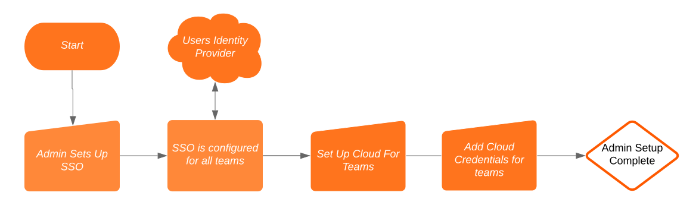

# Kore
Kubernetes for Teams

[](https://circleci.com/gh/appvia/kore)

---
We make it easy for teams to get Kubernetes across multiple clouds. By using Kore an administrator can setup Kubernetes cluster best practices and allow teams to self-provision clusters, environmnets, login to their organisations SSO and deploy their applications.
---

## Overview

Kore is designed to make it easy for teams to provision Kubernetes clusters, namespaces and have a central way to authenticate. For administrators, it's a way to define the types of cloud providers, Kubernetes cluster types, best practices and security policies centrally for all teams. 

Features:
- Support for Github, Openid and SAML authentication
- Create Kubernetes cluster plans with best practice that define teams cluster makeup, (Production plans, Developer plans or Machine learning plans etc.)
- Let Kore provision a google project per team for better cost visibliity and security
- Let Kore provision an AWS Account per team, for better cost visiblity and security
- Support for AWS, Google with support for Azure and VMware coming soon
- Create your own team
- Invite users your team
- Allow anyone in your team to create Kubernetes clusters
- Provision namespaces, (environments) and sign in using single sign on and start deploying applications


## Getting Started


### Administrator Flow



### Developer Team Flow


### Administrator Setup

#### Running Locally 

You will require docker and docker-compose to run this locally. 

*Note* This is just to get up and running locally, it is not suitable to run as production like this!

First checkout the repository:

`git checkout git@github.com/appvia/kore`

And run make demo

```
cd kore
make demo
```

This will run several components using docker compose:

+ Kubernetes API in Docker
+ Kubernetes controller manager
+ Mysql Database
+ Kore API 
+ Redis
+ Kore Web frontend 
+ Dex

The docker compose configuration file can be found in: `hack/compose/demo.yml`

Once running, you will be able to login with the details defined in `hack/compose/demo.yml`, this is `admin` and `password` unless you changed the configuration settings

*Note*: Currently as we use Dex and as it is running locally, any Kubernetes clusters that are provisioned will be unable to access the local running Dex, therefore You will not be able to login to the clusters, this would require running Dex or another IDP Broker / IDP externally.

#### Setup and Configuration

There are three parts of Kore to setup:

1. Setup cloud
2. Setup SSO
3. Setup plans (though default plans come bundled with the product)

Once complete developer teams can login and create teams and clusters in your cloud provider using SSO.


There are two ways to setup Kore:

1. [With the CLI](#With-the-CLI)
2. [Using the web frontend](#Using-the-web-frontend)


#### With the CLI

By running `make demo`, it will build a version of the Kore API Server as well as the CLI.

By defining a korectl configuration file in `$HOME/.korectl/config`

```
server: http://127.0.0.1:10080
```

Is all that is required, you can then do a auth flow to the API server, which will then authorise using either a Defined IDP or Dex if you are using the Demo.

```
./bin/korectl auth
```

Once authenticated, There are several configuration files, which can be found in: `examples` directory:

1. `credentials.yml` : Which is used to define the service account credential for GKE, this will require a Role for GKE in order to work inside of a project.
```
spec:
  region: CHANGE_ME
  project: CHANGE_ME
  account: "THE JSON SERVICE ACCOUNT"
```

The above will need replacing with the region, project name and the service account JSON payload.

2. `allocation.yml` : This is responsible for allocating the Cloud credential to one or more defined teams. To allow it allocatable to every team, this can be left as a wildcard

3. `gke-cluster.yml` : This dfines the shape of the kubernetes clusters, these are essential settings for GKE. You can create many of these with different names i.e. `gke-cluster-dev.yml` and `gke-prod.yml` , make sure to change
```
metadata:
  name: dev
```

To be different names for each cluster shape you would like, as each name needs to be unique. Developer teams can use these names to provision clusters of this shape. 


#### Using the web frontend

If you are logging in with the web frontend, this will be accessible via `http://localhost:3000` , you will get a login screen and should be able to login with whatever is specified in the `hack/compose/demo.yml` . This will be `KORE_ADMIN_PASS:` . 

Once logged in using the credentials provided, you will be able to setup Dex to federate to an IDP, either github, openid or SAML.

You can then configure specific cloud providers, for GCP, this will be a project credential for GKE that should be a service account credential with privileges for GKE. 

Once this is configured, all teams can use these downstream to provision clusters, using the defined plans.

### Developer User


[Architecture]

[Contributing]

[User Management]

[Global Configuration]

[License]


[Overview]: #Overview
[Architecture]: doc/architecture.md
[Cloud Support]: doc/cloud.md
[Contributing]: contributing.md
[User Management]: doc/user-management.md
[Policies]: doc/policies.md
[Global Configuration]: doc/global-configuration.md
[License]: LICENSE
